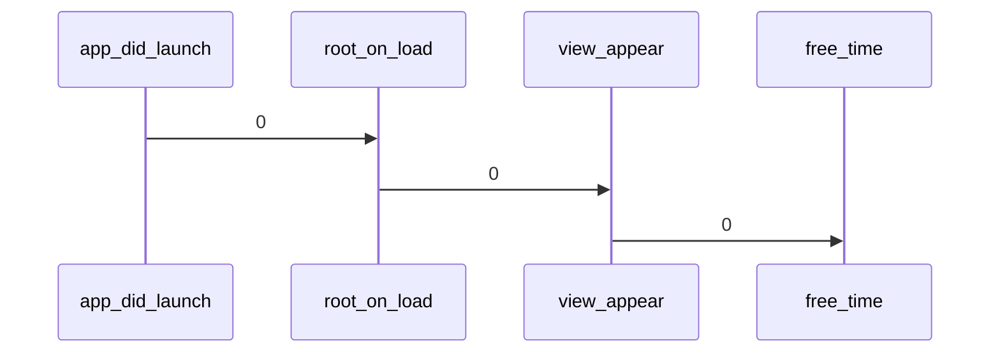

[贝壳iOS App冷启动优化](https://ppt.infoq.cn/slide/show?cid=86&pid=3423)

[脉脉iOS如何启动秒开](https://mp.weixin.qq.com/s/oUApkX3lpVTga0cEvqLlHQ)

[Trip.com APP 启动优化实践](https://mp.weixin.qq.com/s/smWjs2X8HWvcvKW_DSXYJA)

### [启动优化](https://juejin.cn/post/6921508850684133390)

App的启动时间优化，主要是针对冷启动来进行优化的。那么首先我们就需要了解一下App的冷启动过程包含哪些步骤。

（一）dyld阶段：dyld1dynamic link editor），Apple的动态链接器，可用来加载Mach-O文件（可执行文件、动态库等等）。冷启动一个app之后，首先是dyld开始工作，它负责两件事情：

加载App的可执行文件，同时会递归加载所有依赖库的动态库。
当完成可执行文件和动态库的加载之后，就通知Runtime进行下一步处理。

（二）Runtime阶段：在这个阶段，Runtime做了如下的工作：

调用map_images函数对可执行文件的内容进行解析和处理。
在load_images函数中调用call_load_methods，以调用所有Class和Category的+load方法。
进行各种objc结构的初始化（例如objc类的注册，初始化类对象等等）
调用C++静态初始化器以及被_attribute_((constructor))修饰的函数

到此为止，可执行文件和动态库中的所有所有Symbols**（符号，包括 Class， Protocol， Selector， IMP等等）都已经按照规定格式加载到内存中，并且被runtime所管理**

（三）main函数阶段

监控  工具   最佳实践

对于pre-main阶段，Apple提供了一种测量方法，在 Xcode 中 Edit scheme -> Run -> Auguments 将环境变量 DYLD_PRINT_STATISTICS 设为1 
当然我们也可以获取更详细的时间，只需将环境变量 DYLD_PRINT_STATISTICS_DETAILS 设为 1 就可以

Rebase : 在dylib的加载过程中，系统为了安全考虑，引入了ASLR(Address Space Layout Randomization)技术和代码签名。由于ASLR的存在，镜像(Image，包括可执行文件、 dylib和bundle)会在随机的地址上加载，和之前指针指向的地址(preferred_address)会有 一个偏差(slide)，dyld需要修正这个偏差，来指向正确的地址。

bind: Rebase在前，Bind在后，Rebase做的是将镜像读入内存，修正镜像内部的指针，性能消耗主要在IO。Bind做的是查询符号表，设置指向镜像外部的指针，性能消耗主要在CPU计算。

 <!-- ImagePicker->>Memory: 0. Take photo get UIImage
    loop PNGData Convert
        Memory->>Memory: 1. UIImage to PNGData(slow 🐌🐌🐌🐌🐌🐌 )
    end -->

https://b.geekbang.org/article/408339