###  Memory

[iOS Memory Deep Dive](https://developer.apple.com/videos/play/wwdc2018/416/)

[Detect and diagnose memory issues](https://developer.apple.com/videos/play/wwdc2021/10180)

#### Leak

#### Fragmentation

1. Allocate objects with similar lifetimes close to each other.

2. Aim for ***25% fragmentation or less***.

3. Use autorelease pools.

4. Pay extra attention to long running processses.

5. Use allocations track in Instruments.

Getting started with Instruments. WWDC19.

Creating Custom Instruments. WWDC18.

Practical Approaches to Great App Performance. WWDC18.

### Target

1. 开发阶段工具 & XCTest & Baseline

2. 优化指南

### Why reduce memory? -> Not only you App,but also OS.

### Memory > Memory Footprint > Profiliing 

#### Pages

Typically 16KB.

Page types:

Clean & Dirty

#### Memory warnings

#### Typical app memory profile

##### Footprint limits

1. Limits vary by device

2. Apps have a fairly high footprint limit

3. Extensions have a much lower limit

##### Exception upon exceeding limit

1. EXC_RESOURCE_EXCEPTION

### Tools for Profiling Footprint

#### Instruments

1. Allocations

2. Leaks

3. VM Tracker

4. Virtual memory trace

#### Xcode Memory Debugger

#### vmmap

1. vmmap App.memgraph

2. vmmap --summary App.memgraph

#### vmmap and AWK

vmmap -pages xxx.memgraph | grep '.dylib' | awk '{sum += &6} END { print 'Total Dirty Pages: ' sum}'

[image-resizing](https://github.com/NSHipster/articles/blob/master/2019-05-06-image-resizing.md)
https://juejin.cn/post/6844903988077281288

```mermaid
sequenceDiagram
    participant ImagePicker
    participant Memory
    participant Disk
    
    ImagePicker->>Memory: 0. Take photo get UIImage
    loop PNGData Convert
        Memory->>Memory: 1. UIImage to PNGData(slow 🐌🐌🐌🐌🐌🐌)
    end
    Memory->>Disk: 2. PNGData write to Disk(Big data write to disk 🐌 )
    note right of Disk: 优化前流程
    Disk-->>Memory: 3. Read PNGData with UIImage
    loop Compress
        Memory->>Memory: 4. UIImage to JPGData with quility(🐌🐌 slow)
    end
    loop Resize
        Memory->>Memory: 5. Resize with UIGraphicsImageContext(High Memory Cost 🍐🐌🐌 )
    end
    loop JPGData Convert
        Memory->>Memory: 6. Resized Image to JPGData with quility(slow 🐌)
    end
    Memory->>Disk: 7. JPGData to Disk 
```

```mermaid
sequenceDiagram
    participant ImagePicker
    participant Memory
    participant Disk

    ImagePicker->>Memory: 0. Take photo get UIImage
    loop JPGData Convert
        Memory->>Memory: 1. UIImage to JPGData with quility(slow 🐌🐌🐌)
    end
    note right of Disk: 优化后流程
    loop Resize
        Memory->>Memory: 2. Resize with ImageIO(Low Memory Cost 🐌)
    end
    Memory->>Disk: 3. Write to disk with ImageIO with compress
```

