### 图像拍摄-压缩流程体验优化

---

## 理论

---
#### 展示一张590KB的图片，需要占用多少内存？

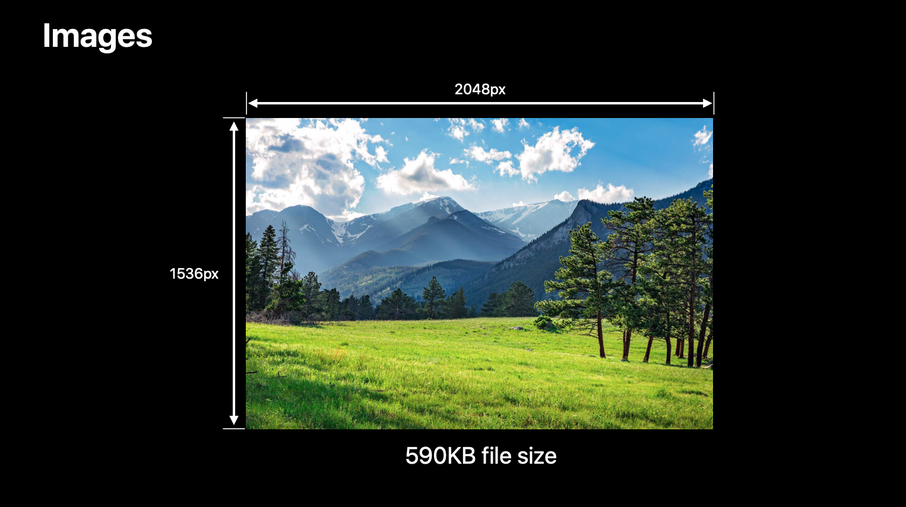

---

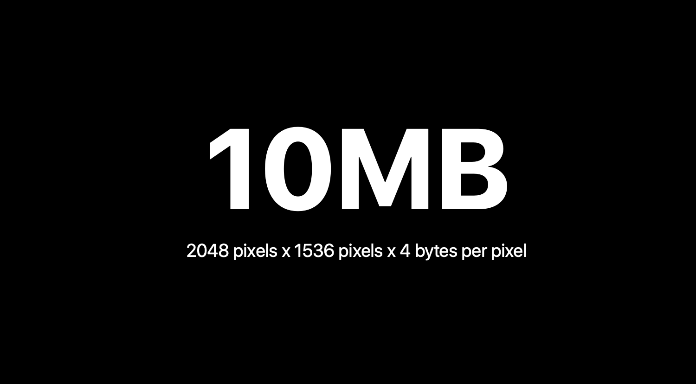

---

# 3024 x 4032 x 4 = 46.5MB

---
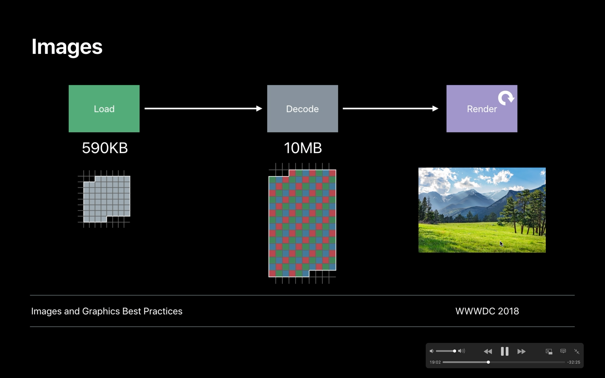

---
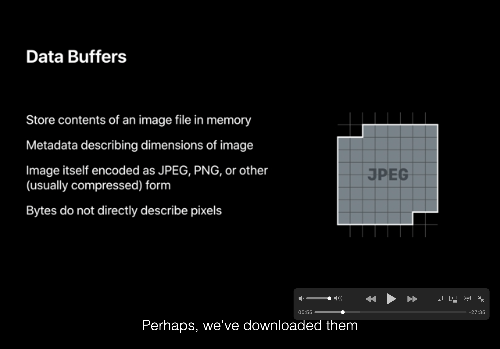

---
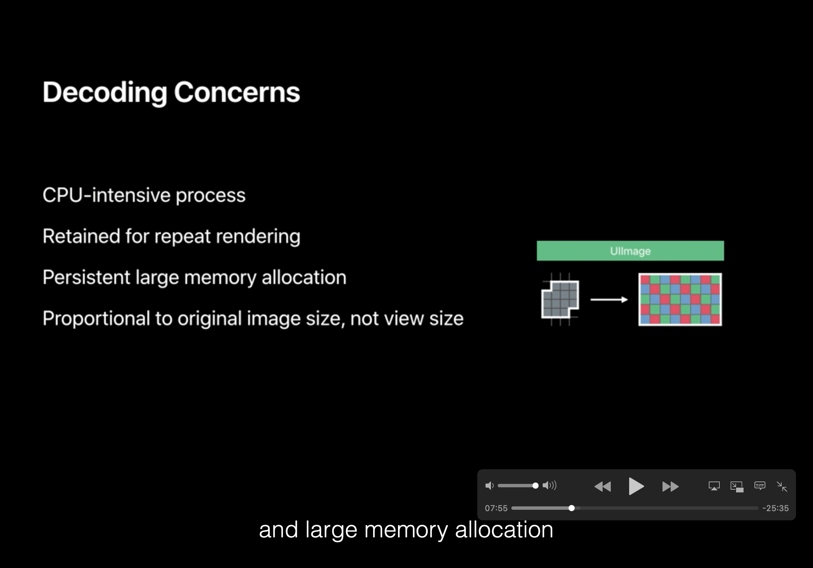

---
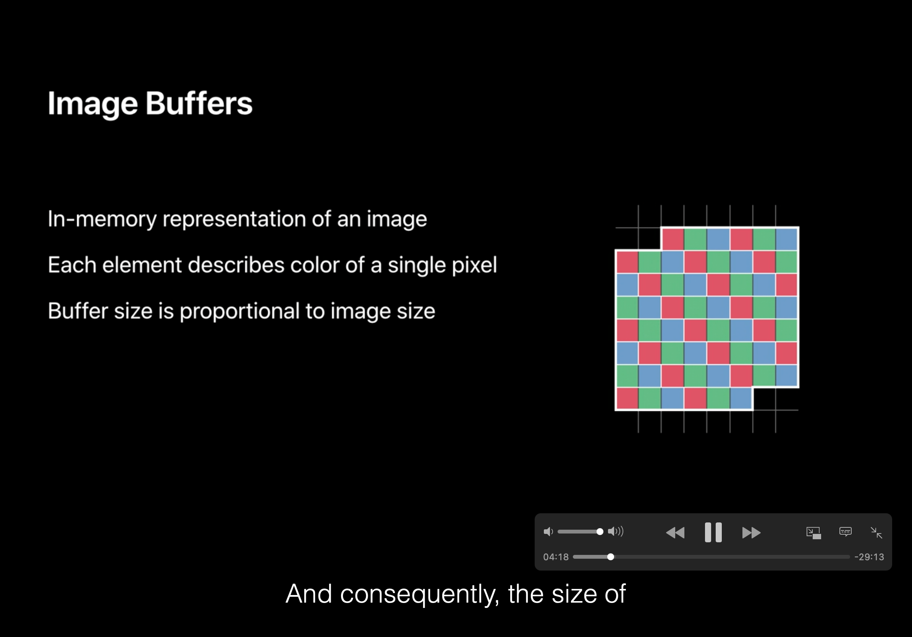

---
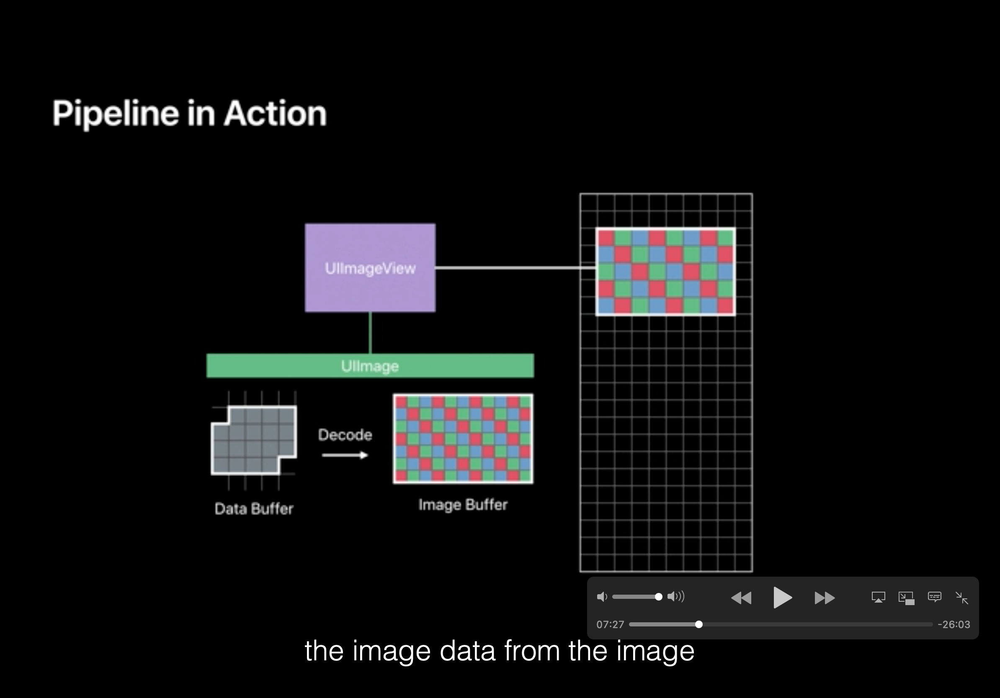

---
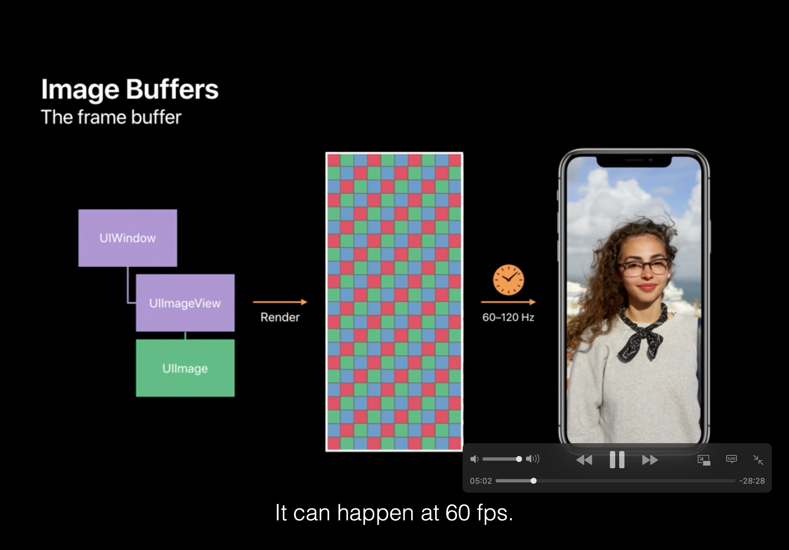

---
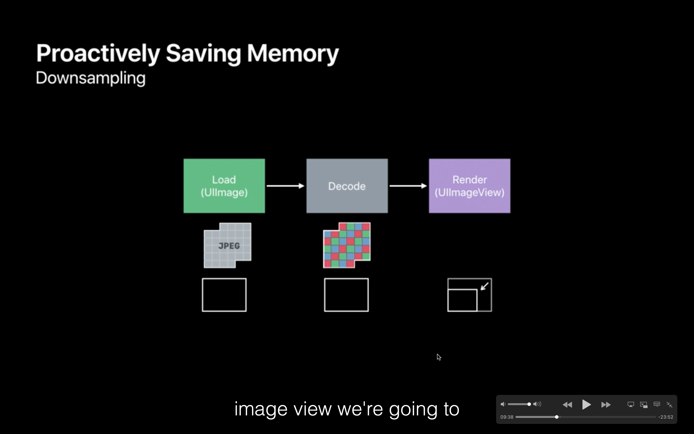

---
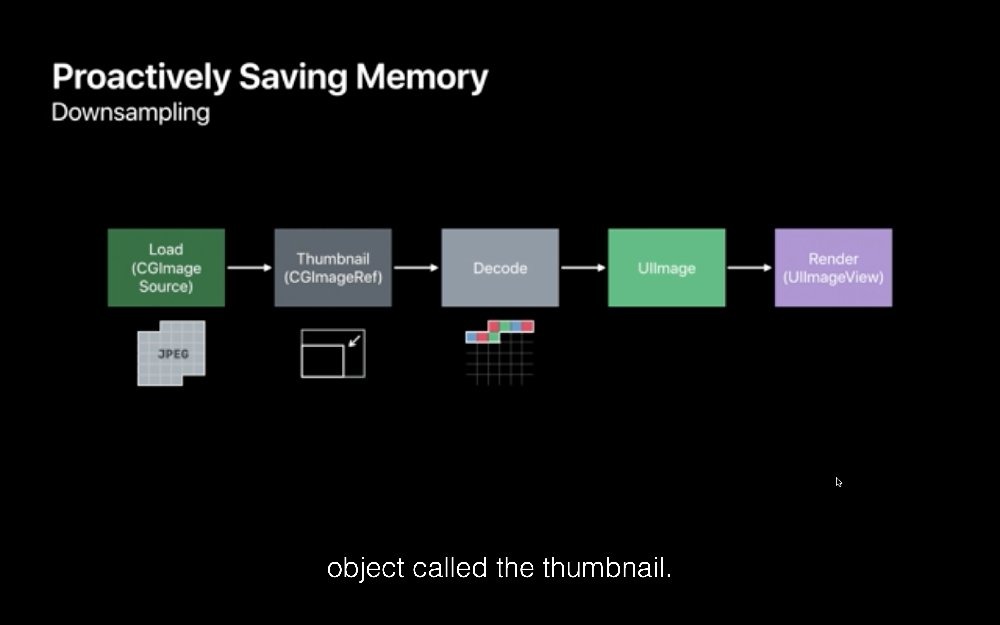

---
## 高内存占用对系统的影响

---
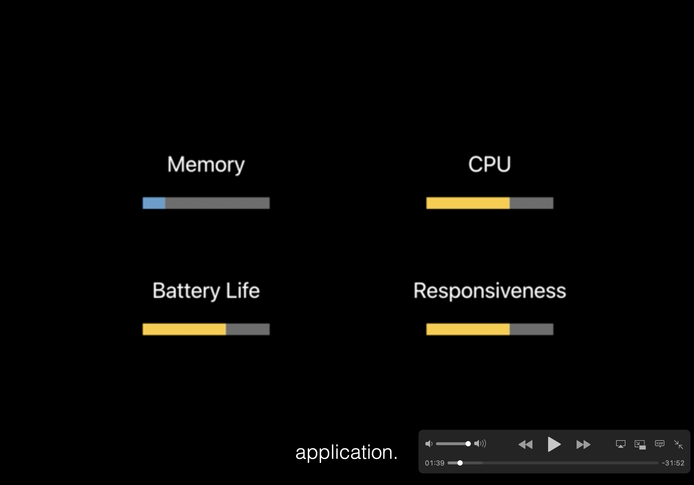

---
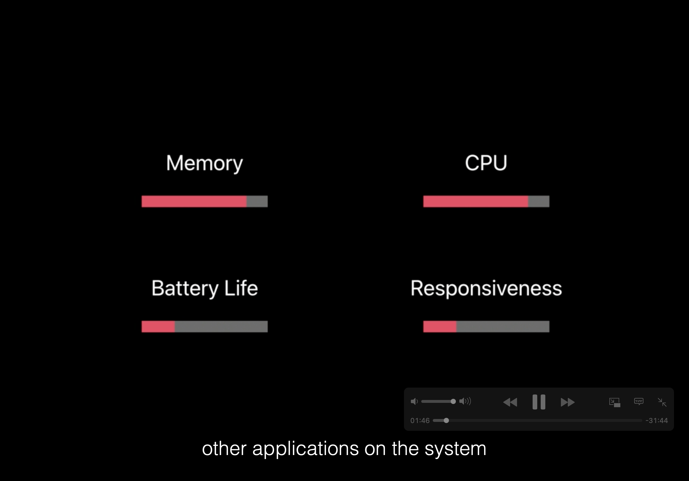

---

## 优化前后流程对比

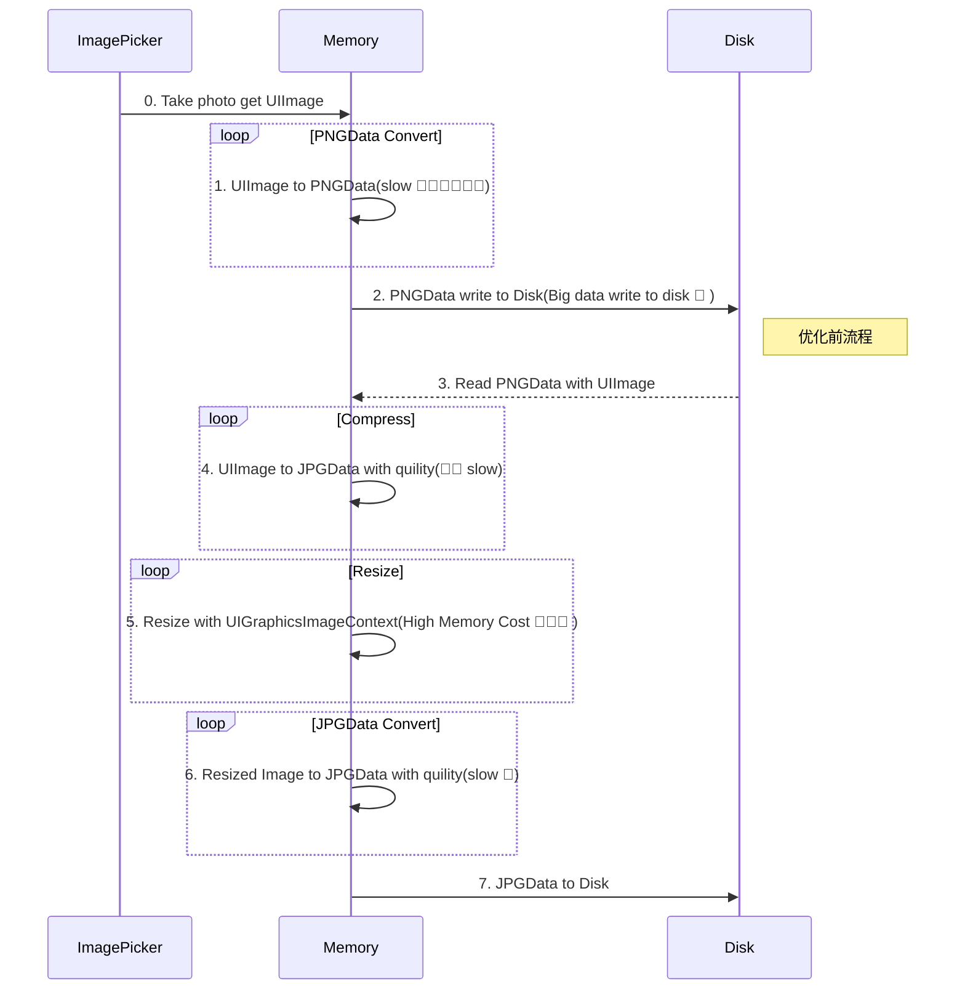

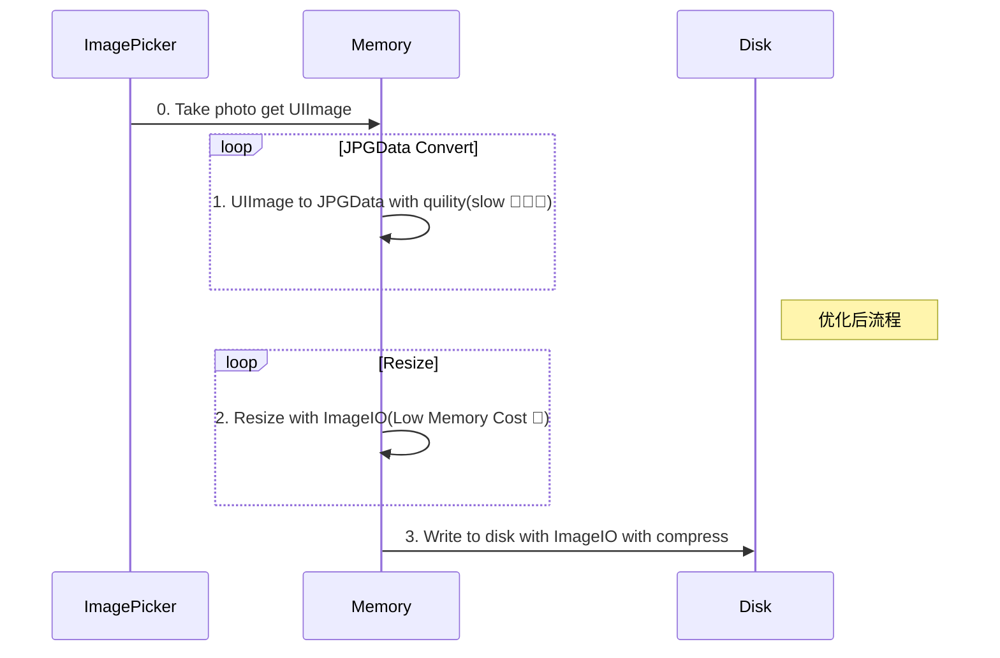
---

## Demo

#### 压缩过程数据对比

ImageWithName vs ImageWithData

Image 读写  assest vs bundle

## 业内进展

---
##### 冷启动优化

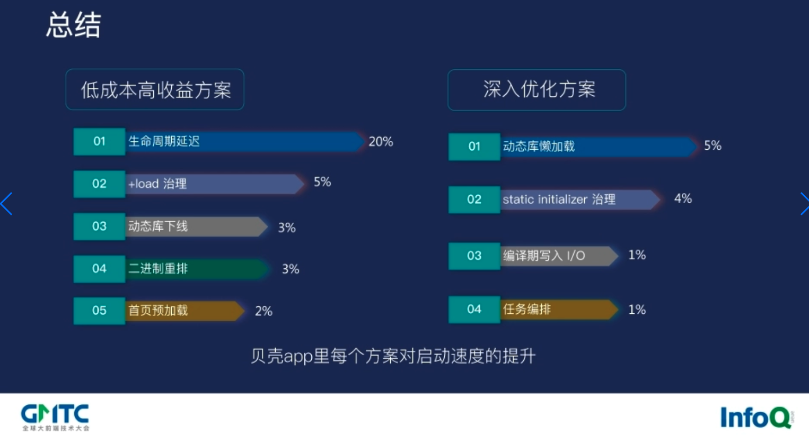

---

[抖音品质建设 - iOS启动优化《原理篇》](https://mp.weixin.qq.com/s/3-Sbqe9gxdV6eI1f435BDg)

[抖音品质建设 - iOS启动优化《实战篇》](https://mp.weixin.qq.com/s?__biz=MzI1MzYzMjE0MQ==&mid=2247487757&idx=1&sn=a52c11f6a6f217bd0d3283de9b00c8bc&chksm=e9d0daefdea753f954cfcb15d5d0f90302a9f45ba06968377644ffe9e5757a69c5b0132d2c8b&scene=178&cur_album_id=1568330323321470981#rd)

[贝壳iOS App冷启动优化](https://ppt.infoq.cn/slide/show?cid=86&pid=3423)

[脉脉iOS如何启动秒开](https://mp.weixin.qq.com/s/oUApkX3lpVTga0cEvqLlHQ)

[Trip.com APP 启动优化实践](https://mp.weixin.qq.com/s/smWjs2X8HWvcvKW_DSXYJA)

---

#### 长期视角，业务如何跑的又快又稳？

业务迭代 > 业务架构 > 基础架构

---

---

---

